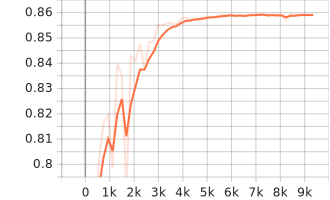
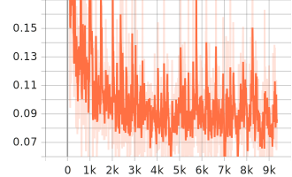
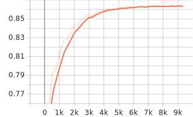
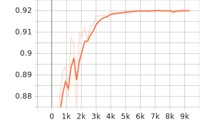
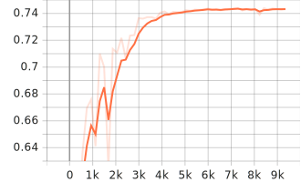
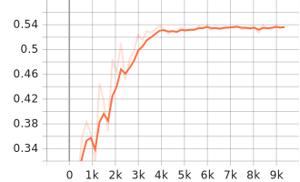

# 🛰️ Multitemporal Semantic Segmentation of Small-Scale Mining using Prithvi EO

This project addresses the detection of **small-scale mining activities** using multitemporal satellite imagery and deep learning.

A **foundation model for Earth Observation (Prithvi EO)** is combined with a **UPerNet decoder** to leverage both **spectral and temporal information**, enabling robust segmentation under strong class imbalance conditions.

---

## 📌 Key Result

**Best Validation mIoU: 0.859**

The model achieves consistent performance improvements during training and converges to a stable solution, demonstrating strong generalization capability.

---

## 🧠 Problem Overview

Detecting mining areas is challenging due to:

- Severe **class imbalance** (few mining pixels vs large background)
- High **spectral similarity** with surrounding terrain
- Strong **temporal dependency**

To address this, the model uses:
13 spectral bands × 2 timestamps (2016–2022)

This allows the model to learn **change-aware representations**, rather than relying on single-date imagery.

---

## 🧩 Model Architecture

- Backbone: `prithvi_eo_v2_600_tl` (pretrained, frozen)
- Decoder: UPerNet
- Input:

(B, 13, 2, H, W)

The backbone provides rich feature embeddings, while the decoder performs dense segmentation.

Freezing the backbone ensures:

- Stable feature extraction  
- Reduced computational cost  
- Focused learning on segmentation  

---

## ⚙️ Training Strategy

- Optimizer: AdamW  
- Loss: Dice Loss (robust to class imbalance)  
- Mixed precision (bf16)  
- Backbone frozen  
- Decoder fully trainable  

Hyperparameters were optimized using **Optuna**, exploring:

- Learning rate  
- Weight decay  
- Dropout  
- Class weighting  

Model selection was based on:
val/mIoU

---

## 📊 Training Behavior

### Loss Convergence

The training loss decreases steadily, indicating stable optimization and effective learning dynamics.

---

### mIoU Progression

The increase in mIoU reflects improved spatial segmentation and better alignment between predictions and ground truth.

---

## 📉 Validation Performance

### Validation mIoU

Validation mIoU stabilizes after several epochs, indicating convergence and consistent generalization.

---

### F1 Score

The F1 score shows a strong balance between precision and recall, particularly important under class imbalance.

---

### IoU (Mining Class)

The IoU for the mining class improves progressively, demonstrating the model's ability to detect minority regions effectively.

---

### Boundary mIoU

Boundary mIoU indicates improved delineation of mining regions, capturing finer spatial details.

---

## 📈 Quantitative Results

- Best validation mIoU: **0.859**  
- F1 Score: **0.920**  
- IoU (mining class): **0.744**

These results confirm that the model successfully captures both:

- Global spatial structure (mIoU)  
- Minority class detection (IoU_1, F1 Score)  

---

## 🖼️ Qualitative Results

### Example Predictions

The model demonstrates:

- Accurate localization of mining areas  
- Good boundary alignment  
- Reduced false positives in background regions  

---

## ⚠️ Limitations

- Frozen backbone limits domain adaptation  
- Patch-based inference may introduce edge artifacts  
- Performance depends on temporal alignment  

---

## 🚀 Future Work

- Test-Time Augmentation (TTA)  
- Backbone fine-tuning  
- Multi-scale supervision  
- Improved handling of class imbalance  

---

## 🧾 Key Contribution

This work demonstrates that incorporating **multitemporal context into foundation models** significantly improves the segmentation of small-scale mining areas.

The combination of:

- Temporal information  
- Pretrained representations  
- Robust loss functions  

enables effective detection of minority classes in Earth Observation tasks.

---

## 📌 Summary

> Multitemporal semantic segmentation using foundation models provides a robust solution for detecting small-scale mining under challenging real-world conditions.
